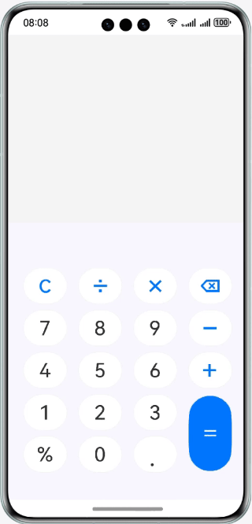

# 实现简易计算器

### 简介

基于基础组件、容器组件，实现一个支持加减乘除混合运算的计算器。效果如图所示：



### 相关概念

- ForEach组件：ForEach基于数组类型数据执行循环渲染。
- TextInput组件：单行文本输入框组件。
- Image组件：Image为图片组件，常用于在应用中显示图片。Image支持加载string、PixelMap和Resource类型的数据源，支持png、jpg、bmp、svg和gif类型的图片格式。

### 工程目录
```
│──entry/src/main/ets	                   // 代码区
│  ├──common
│  │  ├──constants
│  │  │  └──CommonConstants.ets            // 公共常量类
│  │  └──util
│  │     ├──CalculateUtil.ets              // 计算工具类
│  │     ├──CheckEmptyUtil.ets             // 非空判断工具类
│  │     └──Logger.ets                     // 日志管理工具类
│  ├──entryability
│  │  └──EntryAbility.ts	           // 程序入口类
│  ├──pages
│  │  └──HomePage.ets                      // 计算器页面
│  └──viewmodel    
│     ├──PressKeysItem.ets                 // 按键信息类
│     └──PresskeysViewModel.ets            // 计算器页面键盘数据
└──entry/src/main/resource                 // 应用静态资源目录
```


### 相关权限

不涉及

### 新增功能（版本2.0.0）

#### 🧪 科学计算器
- 三角函数：sin, cos, tan, asin, acos, atan
- 对数函数：ln, log
- 指数函数：e^x, x², x³, √, ³√
- 其他函数：n!, |x|, 1/x
- 数学常数：π, e
- 角度/弧度模式切换

#### 📜 计算历史记录
- 本地持久化存储计算历史
- 支持搜索、删除、清空操作
- 时间戳记录，滑动删除功能

#### 🎨 主题切换
- 深色/浅色模式一键切换
- 主题设置永久保存
- 所有UI组件支持主题颜色

#### 📏 单位转换器
- 7大类单位：长度、重量、温度、面积、体积、速度、时间
- 实时转换计算
- 单位互换，常用转换快捷按钮

### 使用说明

#### 基本计算
1. 在键盘输入区域输入表达式。
2. 表达式输入框实时显示键盘输入区域输入的表达式。
3. 结果输出框实时显示表达式的计算结果。

#### 高级功能
1. 点击顶部菜单按钮访问科学计算器、历史记录、单位转换等功能。
2. 点击顶部右侧图标切换深色/浅色主题。
3. 在科学计算器页面使用高级数学函数。
4. 在历史记录页面查看和管理计算历史。
5. 在单位转换页面进行各种单位转换。

### 约束与限制

1. 本示例仅支持标准系统上运行，支持设备：华为手机。
2. HarmonyOS系统：HarmonyOS 5.0.5 Release及以上。
3. DevEco Studio版本：DevEco Studio 6.0.2 Release及以上。
4. HarmonyOS SDK版本：HarmonyOS 6.0.2 Release SDK及以上。

### 详细文档

更多详细信息请参考：
- [新增功能说明.md](新增功能说明.md) - 详细的功能说明文档
- [功能增强总结.md](功能增强总结.md) - 功能增强总结报告
